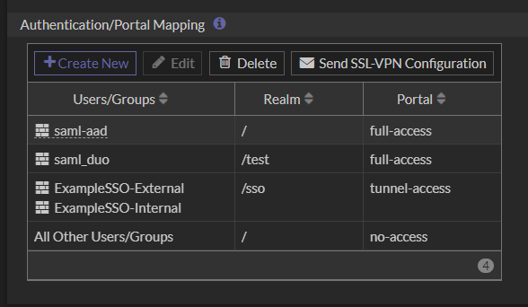

# SAML VPN w/ AAD

## AAD

### Clone Published Application

Find application in app gallery and clone. Or start with a fresh custom application it doesn't really matter.


Give the application a name, this will be displayed to the user. It **can** be changed later.


### Configure Application

Select `Single sign-on` and `SAML`


Default screen


Start with SAML configuration.

Entity ID doesn't need to be a URL but it does need to be unique and matched on the Fortigate side.

Modify the FQDN as needed and add a custom port if you have done so. The Certificate on the SSLVPN service does **not** need to be valid, but should be!


Save when complete.

Modify `Attributes & Claims`

We can remove `givenname`, `surname`, `emailaddress` and `name` claims. Then add a claim called `username` and map it to `user.userprincipalname`.


> The claim names here are arbitrary, as long as they are mapped on the Fortigate end they could be anything. You can also map the username claim to something other than the UPN.

Modify the groups claim name to `groups`


> If you have a large directory you may want to select  `Groups assigned to the application`. This will cause AAD to only send the group IDs in the user is a member of the group **AND** the group is assigned to the application. The default `Security Groups` will send **ALL** groups the user is a member of.

### Gather application information

Download the generated certificate and save the `Login URL` and `Azure AD Identifier` values.


> Using your own certificate is possible however outside the scope of this document.

### Setup the scope of the application

Navigate to `Users and groups` and add the AAD groups which members need to access this VPN. In this example we are adding two groups: `sec-app-vpn-access` for internal users and `ExampleEXTContractors` for contractors to show how to differentiate access on the Fortigate.

> Free tenants can't add groups to Enterprise apps.


We need to know the group OIDs so that we can map them on the Fortigate. Copy them to your info blob.


### Setup conditional access policies for the application

My test tenant doesn't have the licensing for this so this will come later.

## Fortigate Setup

### Upload certificate

Upload the certificate we downloaded as a remote certificate.


Note the cert name and rename (CLI only) because we are not monsters
```
config vpn certificate remote 
    rename REMOTE_Cert_4 to ExampleSSO
end
```


### Configure the SAML user

Configure your SAML SP with the information we gathered previously:
|Fortigate|AAD|
|---|---|
|`idp-entity-id` | `Azure AD Identifier`|
|`idp-single-sign-on-url` | `Login URL`|
|`idp-single-logout-url` | `Login URL`|
|`idp-cert` | Name of cert we uploaded|
|`user-name`| `username` (or custom claim name)|
|`groups`|`groups` (or custom claim name)|

This can be done in the GUI from 7.x.x+ however I still find it easier to do in the CLI. In 6.4.x this will not ever appear in the GUI.
```
config user saml
    edit "AAD-SSO"
        set entity-id "https://vpn.example.com/remote/saml/metadata"
        set single-sign-on-url "https://vpn.example.com/remote/saml/login"
        set idp-entity-id "https://sts.windows.net/dcc5e94c-xxxx-xxxx-940a-ba26b19703xx/"
        set idp-single-sign-on-url "https://login.microsoftonline.com/dcc5e94c-xxxx-xxxx-940a-ba26b19703xx/saml2"
        set idp-single-logout-url "https://login.microsoftonline.com/dcc5e94c-xxxx-xxxx-940a-ba26b19703xx/saml2"
        set idp-cert "ExampleSSO"
        set user-name "username"
        set group-name "groups"
        set digest-method sha1
    next
end
```


### Map AAD Group OIDs to Fortigate Groups

Configure user groups and map them to the AAD group OIDs:

```
config user group
    edit "ExampleSSO-External"
        set member "AAD-SSO"
        config match
            edit 1
                set server-name "AAD-SSO"
                set group-name "f86238a7-c450-484c-b9cb-884ad949af17"
            next
        end
    next
    edit "ExampleSSO-Internal"
        set member "AAD-SSO"
        config match
            edit 1
                set server-name "AAD-SSO"
                set group-name "077925a5-d09c-431b-8acc-97ecbb0b6599"
            next
        end
    next
end
```


### SSLVPN Config

Setup of the SSLVPN in general is outside of scope. This is assuming a portal has already been setup etc. This example is using a default tunnel-access portal which assigns routes based on matching firewall policies.

### (Optional) Create a realm

If SAML is the only authentication method available then the login screen will not even be shown, it will redirect straight away to the IDP. In this example I setup a new realm `/sso`.


### Create authn mapping

In `VPN` - `SSL-VPN Settings` add the new groups to the authentication mapping table.



### Create firewall policies

We need a firewall policy or it will not work. We will give separate access based on the group memberships.


## Client configuration

Setup FortiClient with the new tunnel. Or deploy via EMS. We are not using the external browser for SAML auth in this instance. Note that it requires the Fortigate to be configured and support it.


### Login

Once we click SAML Login we should have a browser pop up and be redirected to our IDP, in this case AAD. Follow the normal process to login.


## Debugging

Common issues and helpful commands

### User is not in tenant

This user is successfully logged in but not in the tenant in which the application resides:


### User is not assigned to application

This user is successfully logged in and exists in the tenant but is not in a group that is assigned access to the application.
\


### Debugging on Fortigate

```
diagnose debug enable 
diagnose debug console timestamp enable 
diagnose debug application samld -1
diagnose debug application sslvpn -1
```

This is a successful login with the user being mapped to a group called `ExampleSSO-External`.


samld output:
```
samld_send_common_reply [122]:     Attr: 17, 27, magic=8ac624d0xxxxxxxx
samld_send_common_reply [122]:     Attr: 18, 29, 2022-09-01T17:00:23.489Z
samld_send_common_reply [118]:     Attr: 10, 95, 'http://schemas.microsoft.com/identity/claims/tenantid' 'dcc5e94c-xxxx-xxxx-940a-ba26b19703xx'
samld_send_common_reply [118]:     Attr: 10, 103, 'http://schemas.microsoft.com/identity/claims/objectidentifier' 'fe6c8365-xxxx-xxxx-9a08-c4ca3377f3a4'
samld_send_common_reply [118]:     Attr: 10, 128, 'http://schemas.microsoft.com/identity/claims/identityprovider' 'https://sts.windows.net/811cbcf4-xxxx-xxxx-b8ad-6457ecf512xx/'
samld_send_common_reply [118]:     Attr: 10, 142, 'http://schemas.microsoft.com/claims/authnmethodsreferences' 'http://schemas.microsoft.com/ws/2008/06/identity/authenticationmethod/password'
samld_send_common_reply [118]:     Attr: 10, 30, 'username' 'external@contractor.com'
samld_send_common_reply [118]:     Attr: 10, 48, 'groups' 'f86238a7-c450-484c-b9cb-884ad949af17' <--- Here we can see group membership mapped to ExampleSSO-External
samld_send_common_reply [118]:     Attr: 10, 48, 'groups' '1187052a-20c5-4372-b34f-96a835746109'
samld_send_common_reply [122]:     Attr: 11, 646, 
...
```


sslvpnd output:
```
...
[275:root:5b]fsv_saml_auth_group:316 find a remote match group: f86238a7-c450-484c-b9cb-884ad949af17, portal: tunnel-access, group: ExampleSSO-External.
[275:root:5b]fsv_saml_auth_group:343 saml client cert: 0.
[275:root:5b]fsv_saml_auth_group:349 add saml group info name.
[275:root:5b]fsv_saml_auth_group:361 store remote saml groups (2) received from: AAD-SSO.
[275:root:5b]fsv_saml_auth_group:367 store remote saml group[0]: f86238a7-c450-484c-b9cb-884ad949af17.
[275:root:5b]fsv_saml_auth_group:367 store remote saml group[1]: 1187052a-20c5-4372-b34f-96a835746109.
...
[279:root:5a]Will add auth policy for policy 93 for user external@contractor.com:ExampleSSO-External
[279:root:5a]Add auth logon for user external@contractor.com:ExampleSSO-External, matched group number 1
```

We can check the list of authenticated users and their group mapping on the Fortigate using `diag firewall auth list`

```
diagnose firewall auth list

192.168.250.11, external@contractor.com
        type: fw, id: 0, duration: 337, idled: 337
        expire: 28463, allow-idle: 28800
        flag(80): sslvpn
        server: AAD-SSO
        packets: in 4 out 7, bytes: in 240 out 420
        group_id: 9
        group_name: ExampleSSO-External

----- 1 listed, 0 filtered ------
```

We can also see these users in the GUI.


Be mindful that a user can be a member of multiple groups.

